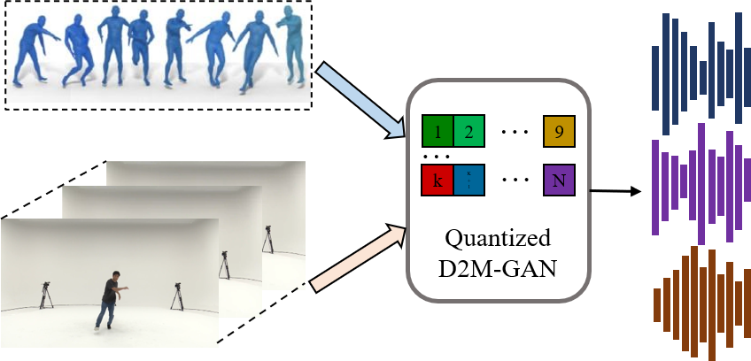

# D2M-GAN
This is the official implementation for D2M-GAN, a VQ-GAN based music generative model for dance videos.
<!-- [arXiv]() | [Project Page]() | [Bibtex](#bibtex)  -->


## 0. Project Overview
In our paper Quantized GAN for Complex Music Generation from Dance Videos, we present Dance2Music-GAN (D2M-GAN), a novel adversarial multi-modal framework that generates complex musical samples conditioned on dance videos.




## 1. Environment Setup

The conda environment named `d2m` can be created and activated using:

```
conda env create -f environment.yaml
conda activate d2m
```

## 2. Data

We conduct experiments on two datasets.

### 2.1 AIST++ Dataset
The AIST++ dataset is a subset of AIST dataset, 

### 2.2 TikTok Dance-Music Dataset


## 3. Training

### 3.1 Training w/ AIST++
To train the D2M-GAN on 

### 3.2 Training w/ TikTok Dance-Music

## 4. Generation

## 5. Project Page and Pre-trained models
For qualitative examples of generated music, please refer to our project page.
We also provide 

## 6. Citation
Please consider citing our paper if you find it useful.

